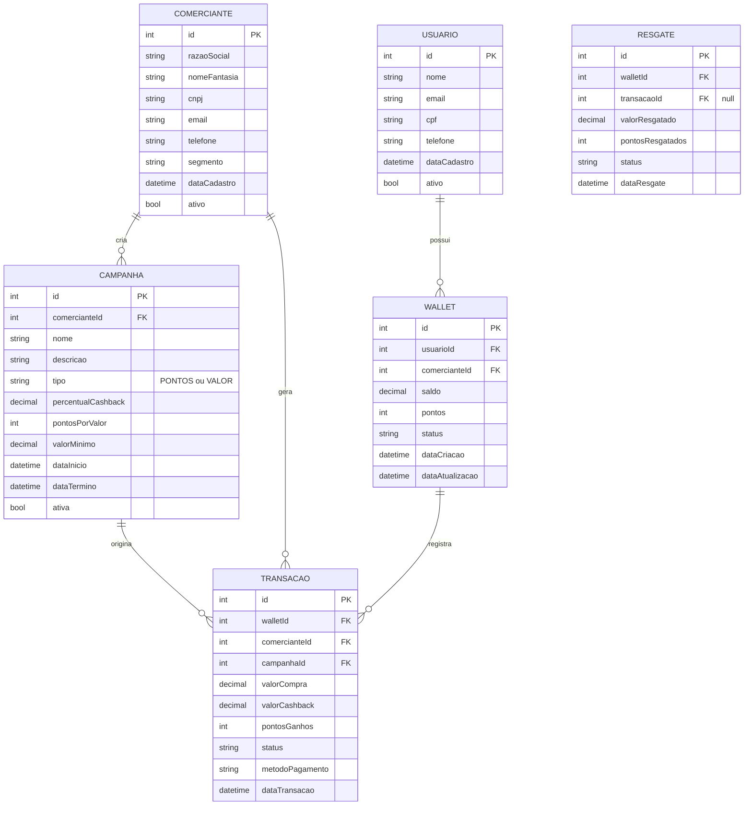

Este diagrama Mermaid representa as principais entidades do sistema CaaS com seus relacionamentos. As entidades incluídas são:

1. **COMERCIANTE**: Armazena dados dos estabelecimentos comerciais.
2. **USUARIO**: Contém informações dos usuários finais que utilizam o sistema de cashback.
3. **WALLET**: Representa a carteira virtual de cada usuário por estabelecimento.
4. **TRANSACAO**: Registra todas as operações de cashback geradas nas compras.
5. **CAMPANHA**: Contém as configurações das campanhas de cashback criadas pelos comerciantes.
6. **RESGATE**: Registra as operações de resgate de cashback/pontos pelos usuários.

Os relacionamentos estabelecidos seguem a lógica de negócio descrita anteriormente, onde:
- Um comerciante pode criar várias campanhas
- Um usuário possui múltiplas wallets (uma por estabelecimento)
- As transações estão associadas a uma wallet, um comerciante e uma campanha
- Os resgates estão associados a uma wallet
