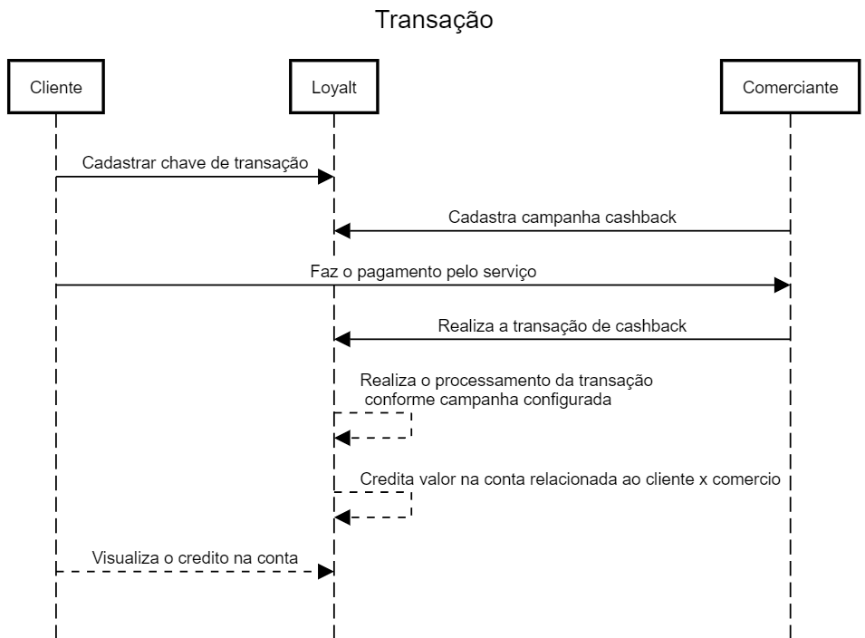

# Plataforma para cartões de fidelidade

**Closing date:** <!-- YYYY-MM-DD. Ideally allow at least 7 days -->

**Status:** Typing <!-- proposed, accepted, rejected, superseded -->

## Resumo
Pensando em comercios de pequeno porte e prestadores de serviços, que desejam realizar campanhas de fidelização de seus clientes, seja por meio de cashback ou pontuação. Propomos a criação de uma plataforma web e aplicativo mobile para gestão de suas campanhas. Criando um ambiente organizado, de facil controle e capaz de proporcionar uma experiência única em seus clientes.

## Motivação
Hoje é muito comum a utilização de cartões de fidelidade, onde a cada compra ou serviço é preechido um espaço no cartão e ao completar todo o cartão, há um desconto ou bonus para o portador do cartão.
Com isso temos uma oportunidade para proporcionar uma otíma experiencia para os clientes e melhor gestão das campanhas por parte dos comerciantes, sendo capaz de reduzir custos com gráficas pois não há necessidade de impressão dos cartões fisicos.

## Proposta de projeto

O cliente ao pagar pelo serviço solicita ao vendedor o cashback, nesse momento o vendedor/prestador do serviço, realiza a transação via App Mobile, informando uma chave previamente cadastrada pelo cliente bem como o valor total da compra/serviço realizado. Assim, as transações serão processadas conforme as campanhas relacionadas ao estabelecimento e o crédito aplicado ao respectivo cliente.

Para utilização dos créditos, o cliente gera um QRCode com o valor que deseja utilizar, na sequência o comerciante faz a leitura do QRCode confirmando a transação.
O valor será creditado na conta do cliente relacionado ao comercio, ou seja, o cliente terá uma conta especifica por comércio que possui créditos.

### Conta

### Chave do cliente
O cliente pode cadastrar algumas chaves que serão a representação do cliente no momento das transações, por padrão a chave de CPF será cadastrada automaticamento no processo de onboarding. 

### Transação
Nesse primeiro momento as transações deverão ocorrer apenas no sentido de Comercio para Cliente.
Deverão conter os dados do Comercio, Cliente e Valor total.

### Campanhas
O comerciante realiza o cadastro de suas campanhas que podem ser por pontos ou cashback e a data de expiração.

##### Pontos
A cada compra ou valor estipulado o cliente receberá um ponto. Ao completar uma quantia X de pontos o cliente terá sua recompença, estipulada pelo comerciante no momento do cadastro da campanha.

##### Cashback
O cliente receberá em forma de crédito um percentual referente a compra realizada. Estipulada pelo comerciante.

## Evoluções
 - Permitir transações entre clientes.
 - Permitir cadastro de campanhas separadas por itens. 
   - Ex. cashback apenas para o serviço de Corte de cabelo
<!-- Describe your proposal, with a focus on clarity of meaning. If it helps,
     you MAY use [RFC2119-style](https://www.ietf.org/rfc/rfc2119.txt) MUST,
     SHOULD and MAY language to help clarify your intentions. -->